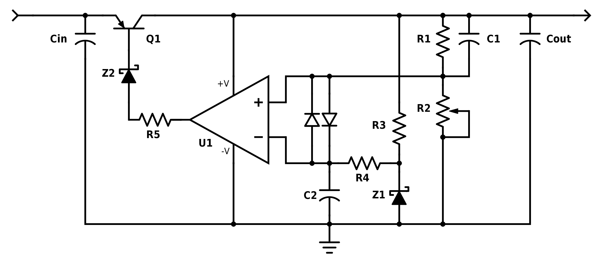

# Extremely Low Noise Regulator

This details a regulator that is used by the Auteur Audio [Lilienfeld's Choir](http://auteuraudio.com/lilienfelds-choir) amplifier.  It
was designed to have both extremely low noise and to be extremely precise.  The reason is that the topology of Lilienfeld's 
Choir, being a non-feedback topology, does not have the power supply rejection witnessed in other topologies.  The objective
of the amplifier was incredibly low noise and extremely fast response, so a highly performance power supply regulator was a necessity.

## Background

The basic notion of regulation has not changed appreciably since the use of a triode and a neon regulator tube.  That is to say, 
regulation has always been an active device comparing the output with a reference and making a correction.  However, there is a lot
of finesse that is required to do this job well, and there are a lot of ways of achieving this effect that work better for certain
scenarios.  Lilienfeld's Choir is an amplifier with nearly constant power requirements, which is an affordance for a regulator 
having some very good qualities at the expense of flexibility.  

Long ago in the semiconductor world it was commonplace to see discrete regulators.  We all have had a bench supply built this 
way.  Like many commonly used things, it made its way to a specialized integrated circuit.  In this case, it was the LM317, released in 
1976 by National Semiconductor.  Since it solved many problems for many people, it rapidly became a hit.  However, like many 
products that solve something reasonably well for a lot of people, it didn't solve some problems as well as might be desired.  This
sentiment was the focus of Mike Sulzer's 1980 _Audio Amateur_ article, where the venerable LM317 was updated using discrete components
to afford a better output.

Over the years there have been a series of better and better variants on the audio regulator.  These have been discussed by many 
in the field — people like Mike Sulzer, Erno Borbely, Jan Didden, Walt Jung, Gary Galo and others — each building on 
the lessons of the design predecessor.  Warren Young has a very nice overview history of the evolution of the discreet 
regulator entitled [Op-Amp Based Linear Regulators](https://tangentsoft.net/elec/opamp-linreg.html).  

The focus of the regulator used by Lilienfeld's Choir is the lowest noise possible.  I will attempt to describe how it is 
different than some of the more commonly seen modern discrete regulators, and why.  This regulator, when built properly, will 
give you a spectral noise on the order of 1.7nV/√Hz, and a voltage stability of better than 100nV over a period of a 
minute.  For those not aware, that is at least 1000 times better on both figures than your average LM317.

## The Circuit

Below is the general circuit:

The most notable feature of this regulator is the op amp being powered on the regulated side.  This was a great innovation on the 
part of Walt Jung's [Super Regulator 2](http://waltjung.org/PDFs/Improved_PN_Regs.pdf) compared with its predecessors.  Not only was 
placement of the op amp an improvement for further reducing power supply coupled noise, but the pass transistor to this day is 
a fantastic choice for medium-sized regulators.  While this regulator has a very novel feedback mechanism using a green LED as as 
a high bandgap voltage supply in a constant current circuit driving the main pass transistor, in practice this leads to higher 
noise than other configurations.  The regulator appearing in the circuit above omits this by directly sinking from the pass 
transistor.  This has clear limitations, as the sink capacity of the op amp and the gain of the pass transistor set the maximum
current the regulator can accommodate.  While this works well for the modest current requirements of Lilienfeld's Choir, if your 
requirements are higher it may be prudent to use a different design.

Like Jung's Super Regulator 2, this regulator makes use of a Zener diode in the sink path of the drive transistor.  I chose a 5.6 volt 
diode as they tend on average to have the lowest noise.  The most important thing is that the Zener gives the op amp plenty of
room to develop potential away from the rails.  That is to say, for known input and output voltages, the Zener must be selected to 
abide the needs of the op amp, and secondarily to abide the desire for quietest junction.  For a reasonable drop of a few volts 
across the pass transistor Q1, the 5.6 volt Zener is ideal.  

The op amp that is used is Linear Technologies LT1128 due to its extremely low noise.  In the feedback controlling the LT1128, 
the two legs of the circuit attempt to be as simple as possible.  In both cases there is a practical balance that needs to be made
between selection of low-valued resistors (recall the LT1128 has an input-referred noise that is less than a 50 ohm resistor) and
realistic choices for decoupling capacitors.  The negative input, which forms the reference, is an LM329 that has a subsequent 
RC filter.  The critical aspects of this part of the circuit are selecting quality components and reducing capacitor 
microphonics. The positive input, which is where feedback is introduced, is just a voltage divider with decoupling of the top leg
to facilitate high frequency suppression.  Given the use of fairly low value resistors, large capacitors are used and an emphasis
on microphonics is a must.  Another absolute must is the use of a high quality metal foil potentiometer.  You absolutely get what 
you are paying for, and this is the place where you put it if you need a good quality power supply.

As introduced with the Sulzer-Borbely regulator, the regulator used on Lilienfeld's Choir has a pre-regulator. The LM317 is a 
great workhorse for this role.  This will keep the input voltage constant and give you more controlled dissipation on the 
pass transistor.  It is prudent to provide good bypassing to prevent spurious noise entering the main regulator.  It is fairly 
common to have fairly significant output filter capacitors on a regulator.  In this case it is for two reasons.  First, the 
normal reasons, providing additional filtering for spurious current draw and decoupling of high frequencies on the output of 
the regulator.  However, in the case of this regulator, the output is not stable without adequate capacitance.  This would often 
not be tolerated, but the objective in this case was the lowest possible noise at all cost.  Even if it means using redundant 
output capacitors to reduce the likelihood of output instability in the face of a component failure.

Compared to most of the discrete regulators that are commonly used — Sulzer, Borbely and Jung — the regulator used by Lilienfeld's 
Choir is remarkably simple.  It takes what I perceive to be some of the best features of all of them, sacrificing some of the 
versatility in exchange for exquisite noise and stability.  The important aspects of making it perform best include choosing the 
best components and using them properly.  Use metal foil whenever possible, particularly for the potentiometer.  Decouple 
the electrolytics with a snubber that works impeccably at high frequencies.  Be attentive to component microphonics and set the 
most critical components in a high quality dissipative material like RTV-162.
